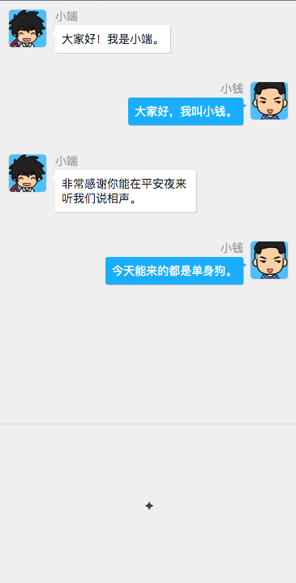

## 方糖小剧场·阅读器

⚠️ 已经更新为V2，内置了头像和小说元信息，不再兼容之前的格式，[V1版本见这里](https://github.com/easychen/h2webreader/tree/v1)

---
## 什么是🎈小剧场

小剧场(H2 Book)是我们定义的一种对话体、类剧本式的开放图书格式。它采用对话和场景来展现故事、描述事实，又非常接近于我们平时使用的聊天软件，所以读起来更为轻松。

📷 截图



<!-- 一键部署到 Vercel 

[](https://vercel.com/new/clone?repository-url=https%3A%2F%2Fgithub.com%2Feasychen%2Fh2reader-host&env=UPLOAD_KEY&envDescription=%E7%94%A8%E4%BA%8E%E4%B8%8A%E4%BC%A0%E5%92%8C%E5%8F%91%E5%B8%83h2book%E7%9A%84Key%EF%BC%8C%E4%B8%8D%E5%86%99%E4%BB%BB%E4%BD%95%E4%BA%BA%E5%8F%AF%E4%BB%A5%E4%B8%8A%E4%BC%A0&buildCommand=cd%20server%20%26%26%20node%20build.js&outputDirectory=server%2Fdist&installCommand=cd%20web%20%26%26%20yarn%20install%20%26%26%20cd%20..%2Fserver%20%26%26%20yarn%20install) -->


## 🖋 如何编写和阅读小剧场

1. 使用小剧场编辑器编写，比如[方糖小剧场的编辑器](https://qing.ftqq.com)
2. 可以随时保存文件为 `.h2doc` 供以后编辑修改
3. 一章写完以后，可导出章节为 `.h2book` 文件，用于分发 
4. 读者拿到 `.h2book` ，通过阅读器阅读。

本项目，即是 Web版本的阅读器网站，你可以把 `.h2book` 上传上来，获得一个阅读二维码，用手机扫码即可阅读。

[Demo网站](https://du.slidechan.com)

---

以下为进阶内容，供程序员参考。

## 小剧场文件格式

小剧场文件有两种格式，分别是：

- 用于作者的多章节格式 `.h2doc`
- 用于读者的单章节格式 `.h2book`

两者均为 json 纯文本。

### .h2doc

包含以下属性

- bookinfo 小说元信息
- chpaters 章节信息
- roles 角色信息
- talks 剧本

### .h2book 

包含以下属性

- meta 章节元信息
- roles 角色信息
- talks 剧本


## 阅读器的架设

你可以自行架设阅读器，并修改其代码进行开发和定制。

### 👨🏻‍💻 开发

```
git clone https://github.com/easychen/h2reader-host
cd h2reader-host
yarn install
yarn start
```

### 部署

```
yarn build
```

然后将 build 目录下的内容放到服务器目录。目录需要支持 rewrite。

注意本项目只附带了 apache 的 rewrite 文件，其他服务器需自己添加。

Nginx 参考：

https://stackoverflow.com/questions/36304302/how-can-i-configure-react-router-to-with-nginx-cherrypy-and-my-current-reactjs-a
```
location / {
    root /var/www;
    index index.html;

    try_files $uri $uri/ /index.html;
}
```

### ☁️ 上传图书

分为静态上传和动态上传两种方式。

#### 静态上传

将 `.h2book` 文件放到服务器 web 目录下的 `books` 之下，即可通过 url （ http://domain/bookname ） 进行访问。

你可以修改 `books/index.json` 中 `books` 数组来调整默认列表。


#### 动态上传

支持通过 PHP 上传 `.h2book` 文件，这样就不用每次手工上传了。 注意默认是任何人都以上传，如果想控制权限，可以自己加一个 http basic 认证在 api.php 前边。


- 确保环境支持php7.0+
- 确保books目录可写
  
然后设置 `books/index.json` 文件

```
{
    "books":
    [
        {"name":"方糖小剧场使用说明","bookurl":"1"},
        {"name":"FreeSource Vol1","bookurl":"2"},
        {"name":"程序员和说学逗唱","bookurl":"3"}
    ],
    "upload_url":"/api.php", <--- 不想开放上传的时候，写成空就行；也可以写其他网站的url。
    "site_url":"http://domain"  <--- 当前阅读器网站的url，用来拼接二维码的地址。最后不要加斜杠。
}
```
访问首页即可在右上方看到上传按钮。

### License

MIT 


